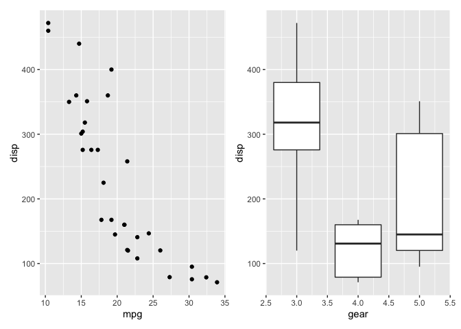
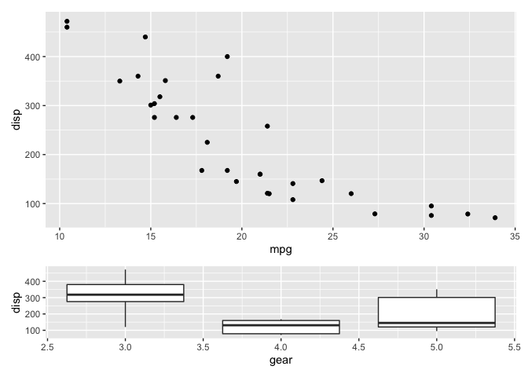
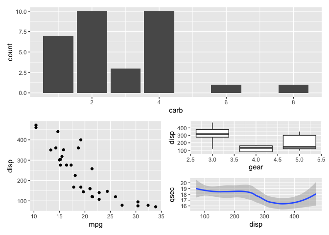
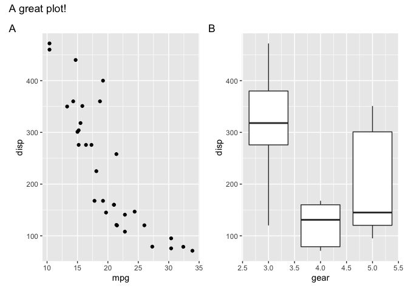
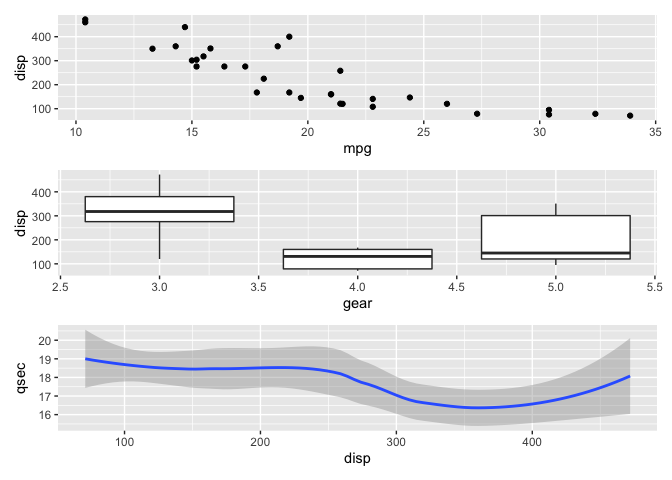
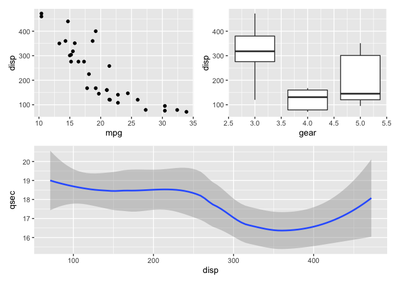
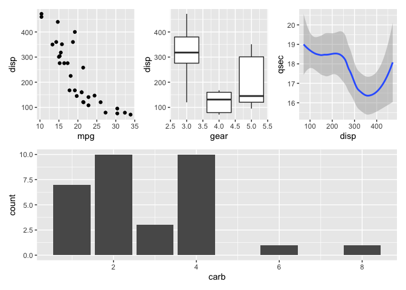
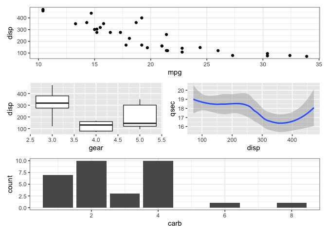

<!-- README.md is generated from README.Rmd. Please edit that file -->
patchwork
=========

[](https://travis-ci.org/thomasp85/patchwork) [](https://ci.appveyor.com/project/thomasp85/patchwork) [](https://CRAN.R-project.org/package=patchwork) [](https://CRAN.R-project.org/package=patchwork)

The goal of `patchwork` is to make it ridiculously simple to combine separate ggplots into the same graphic. As such it tries to solve the same problem as `gridExtra::grid.arrange()` and `cowplot::plot_grid` but using an API that incites exploration and iteration.

Installation
------------

You can install patchwork from github with:

``` r
# install.packages("devtools")
devtools::install_github("thomasp85/patchwork")
```

Example
-------

The usage of `patchwork` is simple: just add plots together!

``` r
library(ggplot2)
library(patchwork)

p1 <- ggplot(mtcars) + geom_point(aes(mpg, disp))
p2 <- ggplot(mtcars) + geom_boxplot(aes(gear, disp, group = gear))

p1 + p2
```



you are of course free to also add the plots together as part of the same plotting operation:

``` r
ggplot(mtcars) +
  geom_point(aes(mpg, disp)) +
  ggplot(mtcars) + 
  geom_boxplot(aes(gear, disp, group = gear))
```


layouts can be specified by adding a `plot_layout()` call to the assemble. This lets you define the dimensions of the grid and how much space to allocate to the different rows and columns

``` r
p1 + p2 + plot_layout(ncol = 1, heights = c(3, 1))
```



If you need to add a bit of space between your plots you can use `plot_spacer()` to fill a cell in the grid with nothing

``` r
p1 + plot_spacer() + p2
```


You can make nested plots layout by wrapping part of the plots in parentheses - in these cases the layout is scoped to the different nesting levels

``` r
p3 <- ggplot(mtcars) + geom_smooth(aes(disp, qsec))
p4 <- ggplot(mtcars) + geom_bar(aes(carb))

p4 + {
  p1 + {
    p2 +
      p3 +
      plot_layout(ncol = 1)
  }
} +
  plot_layout(ncol = 1)
```



### Advanced features

In addition to adding plots and layouts together, `patchwork` defines some other operators that might be of interest. `-` will behave like `+` but put the left and right side in the same nesting level (as opposed to putting the right side into the left sides nesting level). Observe:

``` r
p1 + p2 + p3 + plot_layout(ncol = 1)
```



this is basically the same as without braces (just like standard math arithmetic) - the plots are added sequentially to the same nesting level. Now look:

``` r
p1 + p2 - p3 + plot_layout(ncol = 1)
```



Now `p1 + p2` and `p3` is on the same level...

> A note on semantics. If `-` is read as *subtrack* its use makes little sense as we are not removing plots. Think of it as a hyphen instead...

Often you are interested in just putting plots besides or on top of each other. `patchwork` provides both `|` and `/` for horizontal and vertical layouts respectively. They can of course be combined for a very readable layout syntax:

``` r
(p1 | p2 | p3) /
      p4
```



There are two additional operators that are used for a slightly different purpose, namely to reduce code repetition. Consider the case where you want to change the theme for all plots in an assemble. Instead of modifying all plots individually you can use `*` or `^` to add elements to all subplots. The two differ in that `*` will only affect the plots on the current nesting level:

``` r
(p1 + (p2 + p3) + p4 + plot_layout(ncol = 1)) * theme_bw()
```



whereas `^` will recurse into nested levels:

``` r
(p1 + (p2 + p3) + p4 + plot_layout(ncol = 1)) ^ theme_bw()
```



This is all it does for now, but stay tuned as more functionality is added, such as collapsing guides, etc...
