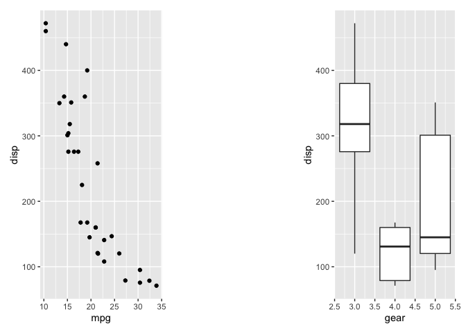

<!-- README.md is generated from README.Rmd. Please edit that file -->
patchwork
=========

[](https://travis-ci.org/thomasp85/patchwork) [](https://ci.appveyor.com/project/thomasp85/patchwork) [](https://CRAN.R-project.org/package=patchwork) [](https://CRAN.R-project.org/package=patchwork)

The goal of `patchwork` is to make it ridiculously simple to combine separate ggplots into the same graphic. As such it tries to solve the same problem as `gridExtra::grid.arrange()` but using an API that incites exploration and iteration.

Installation
------------

You can install patchwork from github with:

``` r
# install.packages("devtools")
devtools::install_github("thomasp85/patchwork")
```

Example
-------

The usage of `patchwork` is simple: just add plots together!

``` r
library(ggplot2)
library(patchwork)

p1 <- ggplot(mtcars) + geom_point(aes(mpg, disp))
p2 <- ggplot(mtcars) + geom_boxplot(aes(gear, disp, group = gear))

p1 + p2
```


you are of course free to also add the plots together as part of the same plotting operation:

``` r
ggplot(mtcars) +
  geom_point(aes(mpg, disp)) +
  ggplot(mtcars) + 
  geom_boxplot(aes(gear, disp, group = gear))
```


layouts can be specified by adding a `plot_layout()` call to the assemble. This lets you define the dimensions of the grid and how much space to allocate to the different rows and columns

``` r
p1 + p2 + plot_layout(ncol = 1, heights = c(3, 1))
```


If you need to add a bit of space between your plots you can use `plot_spacer()` to fill a cell in the grid with nothing

``` r
p1 + plot_spacer() + p2
```



You can make nested plots layout by wrapping part of the plots in parentheses - in these cases the layout is scoped to the different nesting levels

``` r
p3 <- ggplot(mtcars) + geom_smooth(aes(disp, qsec))
p4 <- ggplot(mtcars) + geom_bar(aes(carb))

p4 + 
  (
    p1 + 
      (
        p2 + 
          p3 + 
          plot_layout(ncol = 1)
      )
  ) + 
  plot_layout(ncol = 1)
#> `geom_smooth()` using method = 'loess' and formula 'y ~ x'
```


This is all it does for now, but stay tuned as more functionality is added, such as collapsing guides, etc...
